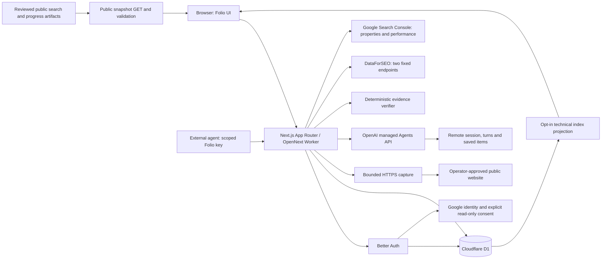

# Folio architecture

Folio is a Next.js application with a public search-results dashboard and private website workspaces. Technical readiness, SEO context, keyword search observations, and captured-evidence evaluations keep separate inputs, scoring, and publication rules. The application uses the **managed OpenAI Agents API** for live agent work. OpenAI runs the agent; Folio owns authentication, capture, run records, result verification, and presentation.

This document describes the implementation and identifies production work still required. See [EVALUATION-STRATEGY.md](EVALUATION-STRATEGY.md) for what the results establish and [docs/MONETIZATION.md](docs/MONETIZATION.md) for proposed commercial packaging.

## Runtime boundaries

| Layer               | Responsibility                                                                                                     | Implementation                                                          |
| ------------------- | ------------------------------------------------------------------------------------------------------------------ | ----------------------------------------------------------------------- |
| Presentation        | Landing page, workspace navigation, charts, evaluations, evidence inspection, agent activity, and proposed pricing | `src/components/`, `src/app/[[...slug]]/page.tsx`                       |
| Public dashboard | Read-only task progress, published results, per-query selection and strict derived counters | `src/lib/public-dashboard.ts`, `src/components/public-benchmark-dashboard.tsx`, `src/app/api/public/benchmarks/route.ts` |
| Server boundary     | Session validation, owner-scoped access, bounded inputs, provider calls, and public response projections           | `src/app/api/`                                                          |
| Authentication      | Email/password, optional Google identity, explicit same-email linking, and persisted sessions                       | `src/lib/auth.ts`, `src/lib/google-auth.ts`, `src/lib/auth-schema.ts`    |
| Agent-facing API    | Scoped key authentication, saved freshness, atomic idempotency and shared run services | `src/lib/agent-api*.ts`, `src/lib/agent-observation-*.ts`, `src/app/api/v1/` |
| Keyword observations | Separate hosted search runs, frozen case/configuration, target matching and comparisons | `src/lib/keyword-benchmark-*.ts`, `src/lib/keyword-search-mode.ts` |
| Database            | D1 stores accounts, private sites/scans, rate limits, and evaluation runs                                          | `src/lib/db.ts`, `migrations/`                                          |
| Technical readiness | Fetch one approved public HTML page; apply the versioned deterministic rubric                                      | `src/lib/scanner.ts`, `src/lib/evaluation.ts`                           |
| Agent integration   | Create managed sessions with initial input, retrieve turns/items, cancel, and expose connection state              | `src/lib/agents.ts`, `src/lib/agent-runs.ts`, and evaluation routes     |
| Evidence evaluation | Typed suite, captures, independent verification, and private run persistence                                       | `src/lib/evals.ts`, `src/lib/eval-verifier.ts`, `src/lib/eval-store.ts` |
| SEO context         | Domain organic overview and backlinks summary with provider provenance                                             | `src/lib/dataforseo.ts`, `src/app/api/seo-data/route.ts`                |
| Search performance  | Owner-authorized Google Search Console imports and private snapshots                                                | `src/lib/search-console.ts`, `src/lib/search-console-store.ts`, `src/app/api/search-console/` |

The deployment target is Cloudflare Workers through OpenNext. Bun manages dependencies and package scripts; explicit Node commands and Miniflare/`workerd` retain their runtimes. `next dev` uses the OpenNext development integration and Wrangler's local D1 binding, backed by Miniflare/`workerd`. Its explicit persistence path is `.wrangler/state/v3`, with remote bindings disabled. Migration/status commands pass Wrangler `.wrangler/state` because its CLI adds `/v3`; local exports run from the repository root using that same default store. Database bindings are obtained per request; they are not cached across Worker requests. See [local D1 persistence, exports, and runtime tests](docs/LOCAL-D1.md) and [Cloudflare and authentication setup](docs/cloudflare-auth.md).

D1 remains the pilot's system of record. The isolated Miniflare integration suite exercises migrations, owner predicates, revisions, reservations, deletion accounting, and restart persistence through its actual binding. Local persistence and private SQL exports do not provision a production database or establish a production recovery policy. Postgres is a future option if measured capacity or specific SQL/transaction requirements justify a migration; moving large evidence objects into R2 is also a proposal, not current implementation.

The initial migration creates Better Auth's account/session tables, `sites`, `scans`, and `rate_limit`. The evaluation migration creates `evaluation_runs`: an owner key and queryable lifecycle columns accompany the private JSON run record, which contains captures, events, output, and verification. It enforces one active evaluation per owner. An atomic reservation also applies the deployment's rolling 24-hour live-run allowance, one by default; failed and ambiguous starts still count. This is a request allowance, not a dollar spending cap.

## Where the managed Agents API runs

Live evaluations use the documented `/v1/agents/sessions` resource and `OpenAI-Beta: agents=v1` header. This is OpenAI's hosted agent orchestration, not an application-owned Agents SDK loop or a renamed Responses call. A server-side application API key requires the documented session permissions and inference permission. [Official Agents API quickstart](https://developers.openai.com/api/docs/guides/agents-api/quickstart)

The website-evidence environment is `none`, which requires initial input when creating the session: the managed agent receives frozen website evidence and returns structured facts, citations, findings, and missing-evidence notices. It has no browser, sandbox, or autonomous DataForSEO lookup tool. An optional `read_saved_seo_report` function returns only the explicitly selected frozen report after owner approval. A review of a capture therefore measures extraction and evidence handling; it does not measure whether ChatGPT, Claude, Perplexity, or Google would discover or recommend the site.

### Live run lifecycle

1. A signed-in owner requests a live evaluation. Server configuration and the operator's approved user-ID list gate provider spending; a user-supplied email or body field cannot establish authorization.
2. Folio reserves the run in D1 before outbound work, validates the target against the reviewed host allowlist, fetches HTTPS HTML with a 190,000-byte limit, computes capture hashes, and persists the captures.
3. Folio persists a creation-attempt marker, then makes one session-creation POST containing the initial task and captured evidence. It saves the session ID returned by that request. There is no second initial-input event; the provider may begin work before Folio receives or persists the ID.
4. OpenAI executes the turn remotely. Navigating away does not make the browser responsible for executing the agent. Folio's evaluation view reconciles active runs by retrieving the remote session, turns, and saved items, including subsequent pages. Retrieval is bounded to ten pages per history collection; an incomplete collection is an error rather than a fabricated complete result.
5. Once a terminal turn and its output are observed, Folio validates the output schema and independently verifies evidence references and supported checks. It persists the result and visible run activity for the owner.
6. Cancellation submits the documented cancellation input. A cancellation request is not a rollback of already performed model work or provider charges.

An `idle` session is not sufficient proof of task success. A completed agent turn is also not a verified website result: output still has to pass the application's schema and evidence checks. With a saved session ID, reconcile the existing session after an interrupted observation. If creation was attempted but no ID could be saved, the provider may have accepted the task and incurred charges; the attempt marker preserves that distinction from a failure before creation. Folio does not automatically recreate or resubmit the task, and the operator must check provider records before deciding what to do next. [Agents API progress and recovery](https://developers.openai.com/api/docs/guides/agents-api/quickstart#2-follow-progress)

Folio's activity list is a stored application view of capture, provider state, output, and verification. It does not claim to expose every model thought or the provider's private dashboard trace. Public API usage is best-effort and can be missing or revised. [OpenAI observability and usage](https://developers.openai.com/api/docs/guides/agents-api/observability)

### Background behavior and its limit

The remote session can work while the user visits another page or closes the browser. Folio performs local reconciliation when the user returns or asks to refresh the run. An optional Cloudflare Cron Worker now calls an authenticated internal endpoint through a service binding every five minutes. Its configuration is disabled by default. Three-run batches, fair last-attempt ordering, a D1 lease, and a shared server secret bound the job. It only reads existing provider state; it never creates a task, returns an application tool result, or sends a notification. Without deployment/enabling, a closed browser can leave local state behind until the next visit.

Recurring creation of new evaluations and delivered notifications remain separate future work. See [background-job configuration and limits](docs/BACKGROUND-JOBS.md).

## Application APIs

| Route                                              | Access and behavior                                                                                 |
| -------------------------------------------------- | --------------------------------------------------------------------------------------------------- |
| `/api/auth/[...all]`                               | Better Auth's authentication handlers                                                               |
| `GET/POST /api/sites`                              | Read or create the signed-in owner's sites                                                          |
| `PATCH /api/sites`                                 | Owner changes that site's technical-result publication flag                                         |
| `GET/POST /api/scans`                              | Owner reads saved scans or runs one approved-page readiness scan                                    |
| `GET /api/leaderboard`                             | Public projection of explicitly published technical scans using the current readiness rubric        |
| `GET /api/public/benchmarks`                       | Unauthenticated, validated public artifacts and derived coverage; no D1, auth or provider access     |
| `GET /api/seo-data`                                | Configuration/authorization only; no paid provider request                                          |
| `POST /api/seo-data`                               | Approved owner deliberately requests organic and backlinks context                                  |
| `GET /api/agents/status`                           | Managed Agents API configuration state; not proof of a successful live request                      |
| `GET/POST /api/plans`                              | Owner reads or saves a private proposed-plan preference; no billing                                 |
| `GET/POST /api/evaluations`                        | Owner lists or creates private demo/live evaluations                                                |
| `GET/PATCH /api/evaluations/[id]`                  | Owner reads a run or requests cancellation                                                          |
| `POST /api/evaluations/[id]/reconcile`             | Owner reconciles the existing managed session and saved output                                      |
| `GET /api/evaluations/[id]/export`                 | Owner downloads the private evidence bundle                                                         |
| `POST /api/evaluations/[id]/tools`                 | Approved owner explicitly returns the selected frozen SEO snapshot to the pending managed tool call |
| `DELETE /api/evaluations/[id]`                     | Owner deletes terminal-run evidence using its current revision; a quota tombstone remains           |
| `GET /api/seo-reports` and `/api/seo-reports/[id]` | Owner reopens saved SEO reports without provider requests                                           |
| `GET /api/search-console`                          | Configuration and stored Google consent only; no provider request                                   |
| `GET /api/search-console/properties`               | Owner explicitly loads readable Google properties                                                  |
| `GET/POST /api/search-console/reports`             | Owner lists saved snapshots or explicitly imports an available property's performance               |
| `GET /api/search-console/reports/[id]`             | Owner reopens a private snapshot without a Google request                                           |
| `GET /api/search-console/finish`                   | Check saved scope and refresh token; fixed local callback redirect                                  |
| `DELETE /api/search-console/connection`            | Owner removes local Google credentials; login identity and saved reports remain                     |
| `POST /api/internal/evaluations/reconcile`         | Enabled secret-authenticated scheduler processes a bounded batch; no caller-selected owner IDs      |

Private endpoints must derive ownership from a validated Better Auth session, never from a model's arguments or a browser-provided owner ID. Database queries include that owner key. Evaluation revisions protect updates from overwriting a newer run state. Read responses for private data use `Cache-Control: private, no-store`.

## DataForSEO as a scoped tool

The existing integration dispatches only `seo_domain_overview` and `seo_backlinks_summary`. Calls go to fixed DataForSEO API endpoints; the caller supplies a validated public domain. Provider authentication is assembled on the server. The organic query is explicitly Google, United States, English, and the backlink authority metric is the provider's 0–100 link metric.

The route requires a validated session and an approved user ID, atomically permits at most 20 lookups per account per hour, and makes at most two provider tasks per lookup. Organic and backlinks outcomes remain independent. Results distinguish zero, missing data, provider error, and unknown billing; they preserve task ID, endpoint, retrieval time, and reported cost. The route reserves a private `seo_reports` row before calling the provider, then persists the immutable normalized result. Interrupted requests remain unconfirmed. List/detail GET requests reopen saved reports without any provider lookup; reports are never auto-published. [DataForSEO implementation notes](docs/DATAFORSEO.md)

A new evaluation may explicitly select an owned, completed SEO report for the exact target host. Folio freezes that report and its hash with the run. The managed `read_saved_seo_report` function takes no arguments and can access only that snapshot. POST `/api/evaluations/[id]/tools` validates a fresh pending root-turn action, reserves one durable tool call per run, and submits the documented tool-result event only after an owner click. Ambiguous submissions are not retried. This is a saved-report tool, not permission for autonomous paid lookups. SEO estimates do not change the technical index rank.

## External agent API and freshness

`/docs/api` serves public reference content and authenticated key controls. `/api/openapi.json`, `/docs/api/reference.md`, and `/llms.txt` expose machine-readable discovery from the implemented contract. `/api/v1` requires a separate Folio bearer key, never a browser cookie or provider credential. Migration `0011_agent_api.sql` stores key hashes, scopes, expiry/revocation, bounded request counters and an owner-scoped idempotency ledger. The complete token is returned once at creation.

The read scope enumerates owned sites/cases and reads saved observations. Evaluate scope adds explicit ensure, reconcile and cancellation; it cannot override server spending approval or reservations. Default freshness is 24 hours. Website age follows the oldest page capture, including frozen replay; keyword age follows the saved request time. Exact target/case and current execution configuration participate in matching.

Ensure atomically binds its idempotency identity to a fresh saved result, a matching active run, or one new reserved run. Retries with the same identity return that run; conflicting input is rejected. GET never starts work or retrieves remote progress. Reconcile retrieves existing provider work and never supplies pending tool answers. API projections omit full captures, private reference values, collection payloads and credentials. See [API contract and recovery](docs/AGENT-API.md).

## Privacy and public information

Search Console uses identity-only Google sign-in followed by explicit incremental read-only consent. Better Auth rejects unverified Google identities, disables implicit account linking, restricts explicit linking to the same email, and enables OAuth token encryption. Provider tokens stay server-side; Better Auth's token-returning HTTP routes are disabled. A connection indicator reflects saved scope and a refresh token, not a fresh provider validation.

Imports validate the exact property against Google's list, then request finalized Web search totals, daily rows, queries, and pages for a fixed 28-day window. Each dimension is bounded to 1,000 rows, with partial/coverage warnings and unknown missing totals. Migration 0008 stores immutable, private owner snapshots capped at 50 per owner. Reopening saved data does not call Google; it is not included in evaluations or sent to OpenAI. Disconnect clears local Google tokens/scope while preserving the identity and history. See [Search Console implementation and production preparation](docs/SEARCH-CONSOLE.md).

| Data                                                                                           | Default exposure                                                                                          |
| ---------------------------------------------------------------------------------------------- | --------------------------------------------------------------------------------------------------------- |
| Provider keys, auth secret, approved account IDs                                               | Server configuration only; absent from client bundles and tracked environment files                       |
| Auth sessions, private sites, scans, captures, expected facts, agent output, errors, and usage | Signed-in owner only                                                                                      |
| Captured input submitted for a live run                                                        | Sent from Folio's server to OpenAI for that evaluation; private does not mean it stays only on the device |
| Domain submitted for an SEO lookup                                                             | Sent to DataForSEO for the chosen lookup                                                                  |
| Search Console property, performance data, and saved snapshots                                  | Sent to/retrieved from Google for an explicit owner action; retained privately for that owner             |
| Google OAuth client credentials and owner access/refresh tokens                                | Server-only configuration or Better Auth storage; absent from report exports and browser API responses  |
| Technical index                                                                                | Explicitly published site URL/name, readiness score, rank, rubric version, and capture time               |
| Sample charts and sample evaluations                                                           | Marked as illustrative; never promoted to measured company results by connecting a key                    |
| Private agent runs | Owner-only browser/CLI records and scoped-key projections; no automatic public export |
| Public search observations | Separately reviewed allowlisted artifact: query, time, execution labels, ordered recommendations, citations and limits |
| Public collection progress | Reviewed query IDs, bounded status values, optional start/finish times and public observation references; no owner/provider IDs, errors or usage |

The site publication toggle applies to the site's latest eligible technical scan, including future scans while the flag remains enabled. It is not permission to publish captures, private expected facts, provider usage, or the separate agent evaluation. The public index is a submitted set of URLs; the application does not yet prove domain ownership or comprehensively rank companies.

`.env*`, `.dev.vars*`, local Wrangler databases, local output, and test reports are ignored. Tracked example environment files contain placeholders only. Keep private operator notes and exports in ignored local storage. A private GitHub repository limits source access; it does not automatically make a separately deployed website private.

The fetcher allows reviewed HTTPS hosts, rejects credentials/IP/local host forms, validates redirect destinations, and limits size, time, and content type. This is a controlled pilot fetch policy, not a general-purpose unrestricted crawler. HTML and tool results are untrusted data to analyze, never authority to change permissions or publication policy.

## Current production boundaries

Private keyword benchmarks use migrations 0009 and 0010 for suites, frozen cases, run/configuration history, creation/cancellation attempts and usage reservations. Browser, CLI and scoped-key APIs share the service. Saving questions for an existing owned website performs no inference. New open-web cases use Astra and unrestricted-domain OpenAI live web search; their hosted sandbox has network disabled. Legacy cases retain their reviewed-domain search/network restrictions and original hashes. Normal limits are six starts per rolling day and one active keyword run, with explicit owner daily exceptions. A saved three-minute deadline is enforced by active reconciliation or CLI `--wait`, not a hard billing cap or deployed keyword scheduler. Comparisons require matching query, target, locale, mode, references and execution settings. Baselines are observations, not answer keys. See [keyword operations](docs/KEYWORD-BENCHMARKS.md).

The public search view loads separately reviewed artifacts whose strict field allowlists exclude owner/run/session IDs, usage, private references, raw provider items and credentials. Completed open-web observations retain original one-based recommendation positions. The dashboard selects the latest observation only for the same exact query; it neither fills missing answers nor combines positions into a general company score. Returned reasons/citations remain observations to inspect, not independently verified factual support. Publication is separate from private run storage and technical site-publication flags. An unresolved creation remains an unknown attempt in private accounting; operational dispositions are documented in [live validation](docs/LIVE-VALIDATION.md).

The developer-tool directory is a different public dataset: reviewed source links and dated `readiness-v1` homepage summaries. Its batch script captures bounded HTML and evaluates it inside workerd without executing page JavaScript. Full captures stay in ignored local storage; published summaries contain bounded checks and content hashes. Local preview captures are excluded from the public directory. Neither this dataset nor keyword search observations reproduce consumer ChatGPT answers or measure execution against other vendors’ APIs.

Authentication, D1 persistence, technical checks, manual DataForSEO access, managed session integration, and private evidence verification have distinct configuration requirements. A configured key is not a successful live integration test. Report live provider verification separately from fixture-driven automated tests.

The intended public origin is `https://usefolio.site`. It requires a real remote D1 binding and migrations, production Worker secrets, matching Better Auth origin and Google callback, and verified deployment/domain configuration. Public Google onboarding additionally requires the external audience and applicable branding/data-access verification; local Testing access is not production approval. No deployment, DNS verification, Google approval, or live Search Console report is established by this architecture document.

Scheduled collection, browser-rendered crawling, consumer AI visibility collection, independently operated cross-company agent benchmarks, ownership verification, team roles, automated retention policies, remote-provider deletion, autonomous provider lookup tools, automatic repairs/deployment, and payment processing require further implementation. The commercial plans in [MONETIZATION.md](docs/MONETIZATION.md) do not create those capabilities.

## Evidence deletion and reproducibility

Terminal-run deletion uses an owner/revision predicate and erases source captures, model output, references, session identifiers and tool activity. A database trigger removes the associated tool-call ledger. It retains only quota-relevant run metadata so deletion cannot reset the daily spending allowance. Reads and exports exclude deleted rows. This does not erase remote OpenAI state or the separately saved SEO report.

The live launch form accepts explicitly confirmed owner reference answers and withholds them from the agent. Replays preserve original references. A private comparison displays check-level changes, model/suite provenance, hashes, reference changes and denominator differences. The offline CLI verifies inert JSON, enforces size/version checks and recomputes outcomes without fetching any bundled URL. Neither hashes nor owner confirmation establish independent truth.

Saved Search Console reports can explicitly open a private website through `/api/sites/from-search-console`. The exact owner report supplies only its public HTTPS target identity; performance rows never enter model inputs. Creation is idempotent, private by default, and atomically capped at 100 websites. The website view reads saved SEO summaries for the selected host and starts a fresh lookup only from its update action. Public technical publication remains separate from private evidence.

## Public dashboard and saved website overview

Plain `/overview` mounts `PublicOverviewShell` and `PublicBenchmarkDashboard`, without Better Auth hooks, private data effects, or the private activity dock. `/leaderboard` always uses the public shell, including when its URL contains workspace-looking hints. The existing opt-in technical index still uses its separate public scan projection. `/overview?view=workspace` explicitly selects account results, and `?view=demo` selects the illustrative dashboard. Legacy overview website/scope hints continue to select the private workflow and cannot grant ownership.

`GET /api/public/benchmarks` reads `public-search-rankings.json`, `public-search-progress.json`, and the separate public homepage summary/catalog. It validates both search artifacts and their exact query/observation relationships, derives `PublicDashboardData`, and returns `Cache-Control: no-store`. Unknown fields, invalid references or malformed data produce a generic 503 without leaking rejected values. The client validates the derived counters and selected observations again. This route performs no authentication, D1 access, provider retrieval, inference or capture.

Published coverage counts questions with a public observation; collection counters separately retain not-started, queued, running, completed, failed, cancelled and unresolved tasks. Completed collection without a public answer remains awaiting publication. A later active task does not remove an older published answer. Distinct website hosts and citation URLs are counted over each query's latest published answer; no average rank is computed. HTML coverage stays separate and excludes local previews.

Task selection uses `/overview?query=<public-query-id>` and native browser history. Search/audience/status filters and a mobile task selector change presentation only. Source titles accompany the exact returned citation URLs, with expandable reasons and observation provenance. Snapshot refreshes use the public GET, currently at 15-second intervals while unpublished tasks other than failed/cancelled remain. These are bundled artifact snapshots, not provider event streaming; production updates require publishing a new application artifact. See [public dashboard behavior and limits](docs/PUBLIC-DASHBOARD.md).

Within the explicit private workspace, `real-overview.tsx` composes owner-scoped saved-site, keyword-suite/run, SEO-report, and Search Console summary endpoints. It mounts beneath an owner-keyed boundary and aborts reads when that boundary changes. Selecting a website uses exact normalized URL matching for keyword cases and technical audits; SEO and Search Console follow their own host/property matching rules. The private overview issues GETs only and suppresses the separate activity dock there.

Metrics use the latest completed answer per question within one search mode. Failed or unresolved later attempts remain separate. The appearance denominator excludes unknown target identities; distinct citations count URLs in the loaded answers. Bounded history and partial reads are disclosed. Page-readiness scores and connected-provider observations retain separate cards and source reports. The sample dashboard is an explicit alternate view.

## Question workspaces and discovery files

The evaluation hub selects **Search questions** for plain `/evaluations`. Explicit `view=page` and legacy website run/target/SEO links select **Page evidence**; explicit `view=search` isolates keyword IDs from website evaluation state. Only the selected workspace is mounted. Login rebuilds validated mode-specific context.

`POST /api/benchmarks` accepts either an existing template selector or a bounded question draft: owned `websiteId`, `name`, 1–10 `questions`, `language`, and `locale`. `question-suite-input.ts` shares validation with the editor; `question-suites.ts` resolves the target from the exact owner's saved site and creates private open-web cases. Draft saving reserves no evaluation and makes no provider call. Four additional six-question starter packs cover work, shopping, services and learning.

`discovery-documents.ts` analyzes supplied text/XML only. The scanner retrieves four fixed origin files through its bounded, allowlisted fetch path and retains status plus parser observations in optional zero-point checks. It does not follow document links, execute instructions, or alter `readiness-v1` weights or the page capture hash. Robots rules are inventoried, llms files are optional conventions, and sitemap analysis is bounded structural checking; none certifies indexing or AI use.

## Authenticated MCP and sandbox SEO

Folio now includes `/api/mcp` for coding clients and `/api/v1/seo` for explicit, idempotent DataForSEO lookups. Keyword sandboxes can opt into one selected-domain SEO lookup with a short-lived capability; existing evaluation keys require a separate `seo` permission. See [MCP setup and behavior](docs/MCP.md) for migration, configuration, client examples and validation limits.

### Advisory semantic review

An explicit owner action can review saved page-evidence fact citations with TypeSafe after deterministic integrity and quote checks. `typesafe-review-store.ts` reserves D1 capacity before inference and retains ambiguity without retry; `typesafe-citations.ts` bounds and validates the transport. This is separate from scoring, publication and reference truth. D1 usage is included in the private cost summary, with money unknown. See [TypeSafe reviews](docs/TYPESAFE-REVIEWS.md).

## Agent-directed website crawl

See [Luna crawl and Jev review](docs/WEBSITE-CRAWL.md): agent-controlled same-website traversal through bounded fetch tools, stored excerpts, one semantic review, and a separate report from search rankings.

## Website keyword research

Managed website questions now support Luna with optional, bounded DataForSEO related-keyword research. General coding clients can use the same research via Folio MCP. See [keyword research](docs/KEYWORD-RESEARCH.md) for authorization, limits, private D1 receipts and cost semantics.
