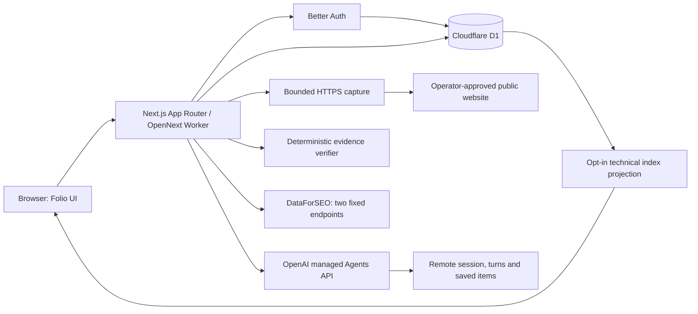

# Folio architecture

Folio is a Next.js application for inspecting a website's technical readiness, SEO context, and how an agent handles captured website evidence. These measurements share a workspace, but keep separate inputs, scoring, and publication rules. The application uses the **managed OpenAI Agents API** for live evidence reviews. OpenAI runs the agent; Folio owns authentication, capture, run records, result verification, and presentation.

This document describes the implementation and identifies production work still required. See [EVALUATION-STRATEGY.md](EVALUATION-STRATEGY.md) for what the results establish and [docs/MONETIZATION.md](docs/MONETIZATION.md) for proposed commercial packaging.

## Runtime boundaries

| Layer               | Responsibility                                                                                                     | Implementation                                                          |
| ------------------- | ------------------------------------------------------------------------------------------------------------------ | ----------------------------------------------------------------------- |
| Presentation        | Landing page, workspace navigation, charts, evaluations, evidence inspection, agent activity, and proposed pricing | `src/components/`, `src/app/[[...slug]]/page.tsx`                       |
| Server boundary     | Session validation, owner-scoped access, bounded inputs, provider calls, and public response projections           | `src/app/api/`                                                          |
| Authentication      | Email/password sign-in and persisted sessions through Better Auth and Drizzle                                      | `src/lib/auth.ts`, `src/lib/auth-schema.ts`                             |
| Database            | D1 stores accounts, private sites/scans, rate limits, and evaluation runs                                          | `src/lib/db.ts`, `migrations/`                                          |
| Technical readiness | Fetch one approved public HTML page; apply the versioned deterministic rubric                                      | `src/lib/scanner.ts`, `src/lib/evaluation.ts`                           |
| Agent integration   | Create managed sessions with initial input, retrieve turns/items, cancel, and expose connection state              | `src/lib/agents.ts`, `src/lib/agent-runs.ts`, and evaluation routes     |
| Evidence evaluation | Typed suite, captures, independent verification, and private run persistence                                       | `src/lib/evals.ts`, `src/lib/eval-verifier.ts`, `src/lib/eval-store.ts` |
| SEO context         | Domain organic overview and backlinks summary with provider provenance                                             | `src/lib/dataforseo.ts`, `src/app/api/seo-data/route.ts`                |

The deployment target is Cloudflare Workers through OpenNext. Bun manages dependencies and package scripts; explicit Node commands and Miniflare/`workerd` retain their runtimes. `next dev` uses the OpenNext development integration and Wrangler's local D1 binding, backed by Miniflare/`workerd`. Its explicit persistence path is `.wrangler/state/v3`, with remote bindings disabled. Migration/status commands pass Wrangler `.wrangler/state` because its CLI adds `/v3`; local exports run from the repository root using that same default store. Database bindings are obtained per request; they are not cached across Worker requests. See [local D1 persistence, exports, and runtime tests](docs/LOCAL-D1.md) and [Cloudflare and authentication setup](docs/cloudflare-auth.md).

D1 remains the pilot's system of record. The isolated Miniflare integration suite exercises migrations, owner predicates, revisions, reservations, deletion accounting, and restart persistence through its actual binding. Local persistence and private SQL exports do not provision a production database or establish a production recovery policy. Postgres is a future option if measured capacity or specific SQL/transaction requirements justify a migration; moving large evidence objects into R2 is also a proposal, not current implementation.

The initial migration creates Better Auth's account/session tables, `sites`, `scans`, and `rate_limit`. The evaluation migration creates `evaluation_runs`: an owner key and queryable lifecycle columns accompany the private JSON run record, which contains captures, events, output, and verification. It enforces one active evaluation per owner. An atomic reservation also applies the deployment's rolling 24-hour live-run allowance, one by default; failed and ambiguous starts still count. This is a request allowance, not a dollar spending cap.

## Where the managed Agents API runs

Live evaluations use the documented `/v1/agents/sessions` resource and `OpenAI-Beta: agents=v1` header. This is OpenAI's hosted agent orchestration, not an application-owned Agents SDK loop or a renamed Responses call. A server-side application API key requires the documented session permissions and inference permission. [Official Agents API quickstart](https://developers.openai.com/api/docs/guides/agents-api/quickstart)

The current evaluation environment is `none`, which requires initial input when creating the session: the managed agent receives frozen website evidence and returns structured facts, citations, findings, and missing-evidence notices. It has no browser, sandbox, or autonomous DataForSEO lookup tool. An optional `read_saved_seo_report` function returns only the explicitly selected frozen report after owner approval. A review of a capture therefore measures extraction and evidence handling; it does not measure whether ChatGPT, Claude, Perplexity, or Google would discover or recommend the site.

### Live run lifecycle

1. A signed-in owner requests a live evaluation. Server configuration and the operator's approved user-ID list gate provider spending; a user-supplied email or body field cannot establish authorization.
2. Folio reserves the run in D1 before outbound work, validates the target against the reviewed host allowlist, fetches HTTPS HTML with an 80,000-byte limit, computes capture hashes, and persists the captures.
3. Folio persists a creation-attempt marker, then makes one session-creation POST containing the initial task and captured evidence. It saves the session ID returned by that request. There is no second initial-input event; the provider may begin work before Folio receives or persists the ID.
4. OpenAI executes the turn remotely. Navigating away does not make the browser responsible for executing the agent. Folio's evaluation view reconciles active runs by retrieving the remote session, turns, and saved items, including subsequent pages. Retrieval is bounded to ten pages per history collection; an incomplete collection is an error rather than a fabricated complete result.
5. Once a terminal turn and its output are observed, Folio validates the output schema and independently verifies evidence references and supported checks. It persists the result and visible run activity for the owner.
6. Cancellation submits the documented cancellation input. A cancellation request is not a rollback of already performed model work or provider charges.

An `idle` session is not sufficient proof of task success. A completed agent turn is also not a verified website result: output still has to pass the application's schema and evidence checks. With a saved session ID, reconcile the existing session after an interrupted observation. If creation was attempted but no ID could be saved, the provider may have accepted the task and incurred charges; the attempt marker preserves that distinction from a failure before creation. Folio does not automatically recreate or resubmit the task, and the operator must check provider records before deciding what to do next. [Agents API progress and recovery](https://developers.openai.com/api/docs/guides/agents-api/quickstart#2-follow-progress)

Folio's activity list is a stored application view of capture, provider state, output, and verification. It does not claim to expose every model thought or the provider's private dashboard trace. Public API usage is best-effort and can be missing or revised. [OpenAI observability and usage](https://developers.openai.com/api/docs/guides/agents-api/observability)

### Background behavior and its limit

The remote session can work while the user visits another page or closes the browser. Folio performs local reconciliation when the user returns or asks to refresh the run. An optional Cloudflare Cron Worker now calls an authenticated internal endpoint through a service binding every five minutes. Its configuration is disabled by default. Three-run batches, fair last-attempt ordering, a D1 lease, and a shared server secret bound the job. It only reads existing provider state; it never creates a task, returns an application tool result, or sends a notification. Without deployment/enabling, a closed browser can leave local state behind until the next visit.

Recurring creation of new evaluations and delivered notifications remain separate future work. See [background-job configuration and limits](docs/BACKGROUND-JOBS.md).

## Application APIs

| Route                                              | Access and behavior                                                                                 |
| -------------------------------------------------- | --------------------------------------------------------------------------------------------------- |
| `/api/auth/[...all]`                               | Better Auth's authentication handlers                                                               |
| `GET/POST /api/sites`                              | Read or create the signed-in owner's sites                                                          |
| `PATCH /api/sites`                                 | Owner changes that site's technical-result publication flag                                         |
| `GET/POST /api/scans`                              | Owner reads saved scans or runs one approved-page readiness scan                                    |
| `GET /api/leaderboard`                             | Public projection of explicitly published technical scans using the current readiness rubric        |
| `GET /api/seo-data`                                | Configuration/authorization only; no paid provider request                                          |
| `POST /api/seo-data`                               | Approved owner deliberately requests organic and backlinks context                                  |
| `GET /api/agents/status`                           | Managed Agents API configuration state; not proof of a successful live request                      |
| `GET/POST /api/plans`                              | Owner reads or saves a private proposed-plan preference; no billing                                 |
| `GET/POST /api/evaluations`                        | Owner lists or creates private demo/live evaluations                                                |
| `GET/PATCH /api/evaluations/[id]`                  | Owner reads a run or requests cancellation                                                          |
| `POST /api/evaluations/[id]/reconcile`             | Owner reconciles the existing managed session and saved output                                      |
| `GET /api/evaluations/[id]/export`                 | Owner downloads the private evidence bundle                                                         |
| `POST /api/evaluations/[id]/tools`                 | Approved owner explicitly returns the selected frozen SEO snapshot to the pending managed tool call |
| `DELETE /api/evaluations/[id]`                     | Owner deletes terminal-run evidence using its current revision; a quota tombstone remains           |
| `GET /api/seo-reports` and `/api/seo-reports/[id]` | Owner reopens saved SEO reports without provider requests                                           |
| `POST /api/internal/evaluations/reconcile`         | Enabled secret-authenticated scheduler processes a bounded batch; no caller-selected owner IDs      |

Private endpoints must derive ownership from a validated Better Auth session, never from a model's arguments or a browser-provided owner ID. Database queries include that owner key. Evaluation revisions protect updates from overwriting a newer run state. Read responses for private data use `Cache-Control: private, no-store`.

## DataForSEO as a scoped tool

The existing integration dispatches only `seo_domain_overview` and `seo_backlinks_summary`. Calls go to fixed DataForSEO API endpoints; the caller supplies a validated public domain. Provider authentication is assembled on the server. The organic query is explicitly Google, United States, English, and the backlink authority metric is the provider's 0–100 link metric.

The route requires a validated session and an approved user ID, atomically permits at most 20 lookups per account per hour, and makes at most two provider tasks per lookup. Organic and backlinks outcomes remain independent. Results distinguish zero, missing data, provider error, and unknown billing; they preserve task ID, endpoint, retrieval time, and reported cost. The route reserves a private `seo_reports` row before calling the provider, then persists the immutable normalized result. Interrupted requests remain unconfirmed. List/detail GET requests reopen saved reports without any provider lookup; reports are never auto-published. [DataForSEO implementation notes](docs/DATAFORSEO.md)

A new evaluation may explicitly select an owned, completed SEO report for the exact target host. Folio freezes that report and its hash with the run. The managed `read_saved_seo_report` function takes no arguments and can access only that snapshot. POST `/api/evaluations/[id]/tools` validates a fresh pending root-turn action, reserves one durable tool call per run, and submits the documented tool-result event only after an owner click. Ambiguous submissions are not retried. This is a saved-report tool, not permission for autonomous paid lookups. SEO estimates do not change the technical index rank.

## Privacy and public information

| Data                                                                                           | Default exposure                                                                                          |
| ---------------------------------------------------------------------------------------------- | --------------------------------------------------------------------------------------------------------- |
| Provider keys, auth secret, approved account IDs                                               | Server configuration only; absent from client bundles and tracked environment files                       |
| Auth sessions, private sites, scans, captures, expected facts, agent output, errors, and usage | Signed-in owner only                                                                                      |
| Captured input submitted for a live run                                                        | Sent from Folio's server to OpenAI for that evaluation; private does not mean it stays only on the device |
| Domain submitted for an SEO lookup                                                             | Sent to DataForSEO for the chosen lookup                                                                  |
| Technical index                                                                                | Explicitly published site URL/name, readiness score, rank, rubric version, and capture time               |
| Sample charts and sample evaluations                                                           | Marked as illustrative; never promoted to measured company results by connecting a key                    |
| Agent evaluation publication                                                                   | Private only in this implementation; no automatic index export                                            |

The site publication toggle applies to the site's latest eligible technical scan, including future scans while the flag remains enabled. It is not permission to publish captures, private expected facts, provider usage, or the separate agent evaluation. The public index is a submitted set of URLs; the application does not yet prove domain ownership or comprehensively rank companies.

`.env*`, `.dev.vars*`, local Wrangler databases, local output, and test reports are ignored. Tracked example environment files contain placeholders only. Keep private operator notes and exports in ignored local storage. A private GitHub repository limits source access; it does not automatically make a separately deployed website private.

The fetcher allows reviewed HTTPS hosts, rejects credentials/IP/local host forms, validates redirect destinations, and limits size, time, and content type. This is a controlled pilot fetch policy, not a general-purpose unrestricted crawler. HTML and tool results are untrusted data to analyze, never authority to change permissions or publication policy.

## Current production boundaries

Authentication, D1 persistence, technical checks, manual DataForSEO access, managed session integration, and private evidence verification have distinct configuration requirements. A configured key is not a successful live integration test. Report live provider verification separately from fixture-driven automated tests.

Scheduled collection, browser-rendered crawling, consumer AI visibility collection, independently operated cross-company agent benchmarks, ownership verification, team roles, automated retention policies, remote-provider deletion, autonomous provider lookup tools, automatic repairs/deployment, and payment processing require further implementation. The commercial plans in [MONETIZATION.md](docs/MONETIZATION.md) do not create those capabilities.

## Evidence deletion and reproducibility

Terminal-run deletion uses an owner/revision predicate and erases source captures, model output, references, session identifiers and tool activity. A database trigger removes the associated tool-call ledger. It retains only quota-relevant run metadata so deletion cannot reset the daily spending allowance. Reads and exports exclude deleted rows. This does not erase remote OpenAI state or the separately saved SEO report.

The live launch form accepts explicitly confirmed owner reference answers and withholds them from the agent. Replays preserve original references. A private comparison displays check-level changes, model/suite provenance, hashes, reference changes and denominator differences. The offline CLI verifies inert JSON, enforces size/version checks and recomputes outcomes without fetching any bundled URL. Neither hashes nor owner confirmation establish independent truth.
