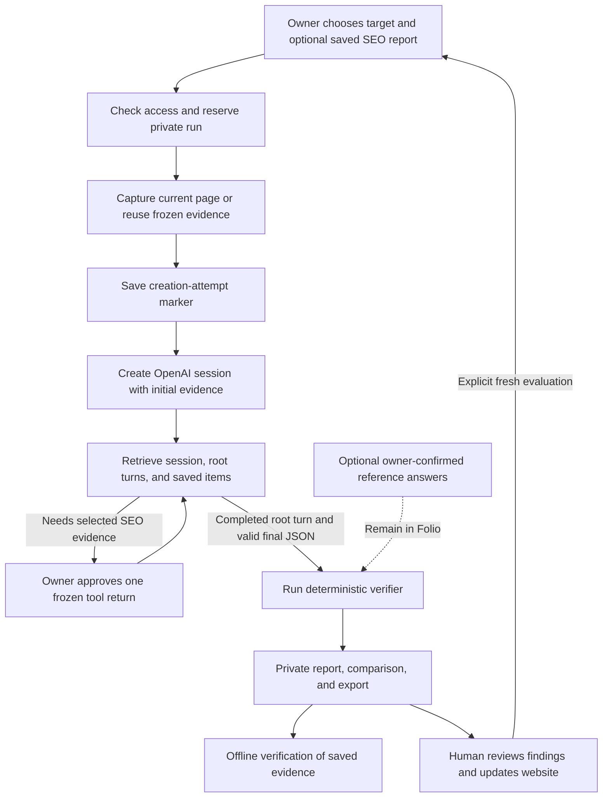

# The Folio evaluation loop

Folio currently captures a website, asks a managed OpenAI agent to review its evidence, independently checks the return, and saves a private report. The owner can inspect, export, compare, or start another evaluation. Applying website improvements and deciding to retest remain human actions.

The [frontend workflow](FRONTEND-WORKFLOW.md) maps this loop to the actual screens: audit/SEO handoffs, account and target preflight, explicit paid start, agent returns, comparison baselines, frozen replay, and a fresh form with cleared references and SEO selection.

The core path completed a real live run on 13 September 2026. See [live validation](LIVE-VALIDATION.md) for its actual outcomes and limits, [evaluation strategy](../EVALUATION-STRATEGY.md) for scoring, and [architecture](../ARCHITECTURE.md) for infrastructure.

## One evaluation, end to end

1. **Define the input.** Choose an approved HTTPS target. Optionally confirm product/pricing reference answers and select one completed, privately saved SEO report for the exact domain. Reference answers are withheld from the model; owner confirmation does not independently establish truth.
2. **Authorize and reserve.** Better Auth establishes the owner. Server configuration controls provider access, allowed targets, and run limits. D1 reserves the run before outbound work. The default is one live attempt per rolling 24 hours, with one active run per owner. Failed and ambiguous attempts count; a run-count limit is not a dollar budget.
3. **Freeze the evidence.** A fresh run fetches one page, bounded to 80 KB, and saves its UTF-8 text, URL, timestamp, SHA-256 hash, and technical checks. Redirects are checked against the host allowlist; page scripts do not execute. A selected SEO report is copied into the run with its original retrieval timestamp and a SHA-256 hash computed over the frozen report. Its content is withheld from the initial model input and made available through the selected-report tool.
4. **Start exactly once.** Save a creation-attempt marker, then send one `POST /v1/agents/sessions` with the instructions and initial evidence. `environment.type: "none"` requires that initial input. Save the returned session ID. There is no second initial-message POST and no automatic retry after an ambiguous creation response. The [official session guide](https://developers.openai.com/api/docs/guides/agents-api/sessions) describes this API contract.
5. **Follow the managed turn.** OpenAI executes remotely. Folio retrieves saved session state, turns, and items. The visible workspace polls queued/running runs every ten seconds. Needs-attention runs require an explicit refresh/action. The optional scheduler can reconcile up to three existing runs every five minutes, including needs-attention runs; it is disabled until production configuration is supplied. Neither polling nor the scheduler creates new evaluations or returns pending tool results.
6. **Handle an optional tool request.** For a matching pending `read_saved_seo_report` call, the owner selects **Return saved SEO evidence**. Folio verifies the session, active root turn, selected capture, and ownership, reserves one tool submission, and sends the frozen result. This makes no new DataForSEO lookup, but can resume paid OpenAI inference. An uncertain tool submission is not sent again automatically.
7. **Verify and retain the outcome.** Require a completed root turn and its completed assistant `final_answer` item. Parse the strict evaluation JSON, then run the independent verifier. Save the result, supported findings, exact citations, limitations, observed usage, and activity. A completed run may contain failed or unmeasured checks.

## What the verifier checks

The current `website-evidence-v1` suite emits eight checks:

| Check | Evidence used |
| --- | --- |
| Frozen source integrity | Capture hashes and unique evidence IDs. |
| Structured return | Required fields and types; `publicationReady: false`. |
| Product-name accuracy | A separately supplied reference name, when available. |
| Pricing accuracy | Separately supplied amount, currency, interval, or explicit absence. |
| Exact citations | Every returned quote must occur literally in its identified capture. |
| Extracted-fact coverage | Field-specific citations for non-null product/pricing facts. |
| Finding evidence links | Exact finding citations supporting the referenced evidence IDs. |
| Readable source | Deterministic readability recomputed from the hashed page HTML. |

Every check is **pass**, **fail**, or **unmeasured**. The displayed percentage is rounded `100 × passed / (passed + failed)`; it is `null` when nothing is measured. Always retain the unmeasured count. Exact quotes establish text occurrence, not the truth of the source or the validity of an interpretation. These checks do not establish search position, consumer-AI recommendation frequency, or a public company rank.

In the first live test, all three quotations matched. Four checks passed, one failed because the example page had only 19 visible words, and three remained unmeasured. That is a completed evaluation with preserved limitations.

## The three ways to run another check

| Operation | What changes | Provider work | What it answers |
| --- | --- | --- | --- |
| Offline verification | Recomputes checks from the exported captures, saved output, and reference answers. | No network or inference. | Does this bundle reproduce its saved outcomes? |
| Frozen model replay | Creates a new run using the original captures and references. No website recapture. | A new paid managed session. | What does another model trial return for this evidence? |
| Fresh evaluation | Fetches the website again; the owner can choose current references and a different saved SEO report. | A new page capture and paid managed session. | What does the current website expose? |

Offline verification is available with `bun run eval:verify <bundle.json>`. A bundle can be internally consistent without authenticating its source or provider. Frozen replay preserves evidence, not an immutable copy of every execution setting: the current configured model and evaluator instructions are used. A complete versioned experiment manifest remains future work.

The private comparison view requires completed runs and separates demo from live results. It shows per-check changes and flags changed captures. A changed source hash alone does not suppress the percentage difference; changed target, model, suite, references/expectations, or measurement coverage do. Treat any before/after result as an observation, not proof that a particular edit caused the difference.

## Failure and recovery rules

| Situation | Current behavior |
| --- | --- |
| Capture fails before creation | Save a failed attempt; no invented website score. |
| Creation response is uncertain | Preserve needs-attention status and unknown cost. Recover the original session where possible; do not create a replacement automatically. |
| Provider is idle without a completed root outcome | Keep the outcome unresolved. Idle is not success. |
| Root completed but final item is missing or has no explicit final-answer phase | Continue waiting for the saved final item; there is currently no expiry fallback for this case. |
| Final output fails the JSON contract | Mark the run failed; accept no score. |
| User requests cancellation | Send cancellation, then retrieve the actual terminal outcome. Acknowledgement is not terminal cancellation. |
| Usage is absent | Keep it unknown; do not label the run free. |

Owner-only reports and exports use private, no-store responses. Deleting a terminal evaluation clears Folio's evidence and tool records while retaining minimal quota accounting. It does not remove remote OpenAI sessions, separate SEO reports, backups, or existing downloads. Active runs must first reach a terminal outcome.

## Closing the improvement loop

Today, an owner can inspect a finding, review/download a technical repair, apply it to the website, start a fresh evaluation, and compare completed reports. Folio does not yet persist a single change record linking those actions, automatically publish repairs, or schedule fresh evaluations.

The next implementation milestone is a saved **baseline → approved change → implementation confirmation → fresh retest → check differences** record. It should retain the original evidence, distinguish changed references/model settings from changed page content, and show failures and unmeasured outcomes. Recurring fresh measurements need explicit opt-in and monetary budgets before activation.

An evaluated company's own API would be a separate task-success suite: a defined task, an approved test endpoint, bounded credentials/actions, expected response assertions, and a recorded result. It is not part of this captured-page suite. The current APIs have distinct jobs: OpenAI executes the review, Folio stores/verifies it, and DataForSEO supplies independently requested SEO observations.

## Where this lives

- [Run creation, reconciliation, cancellation](../src/lib/agent-runs.ts) and [OpenAI transport](../src/lib/agents.ts).
- [Suite and result contract](../src/lib/evals.ts), [deterministic verifier](../src/lib/eval-verifier.ts), and [private storage](../src/lib/eval-store.ts).
- [Saved SEO tool](../src/lib/managed-seo-tool.ts), [browser polling](../src/components/evaluation-workspace.tsx), and [optional background job](../src/lib/eval-reconciliation-job.ts).
- [Comparison logic](../src/lib/eval-comparison.ts), [offline CLI](../scripts/verify-evaluation.ts), and [evidence deletion](../src/lib/eval-deletion.ts).

The live validation covers one basic captured-page run and offline reproduction. Fixture-backed tests cover the broader lifecycle, tool, uncertainty, and isolation cases. Documentation updates do not imply additional provider runs or a deployed scheduler.
